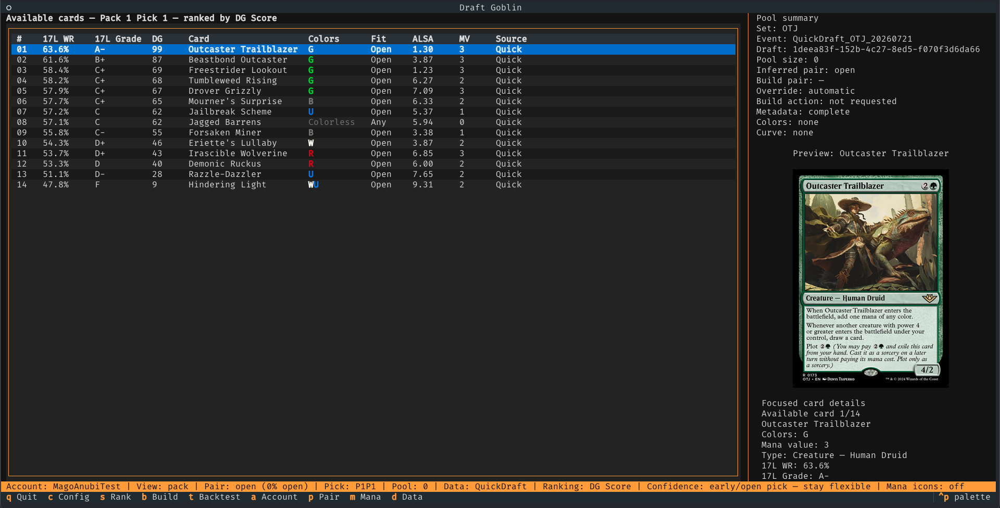
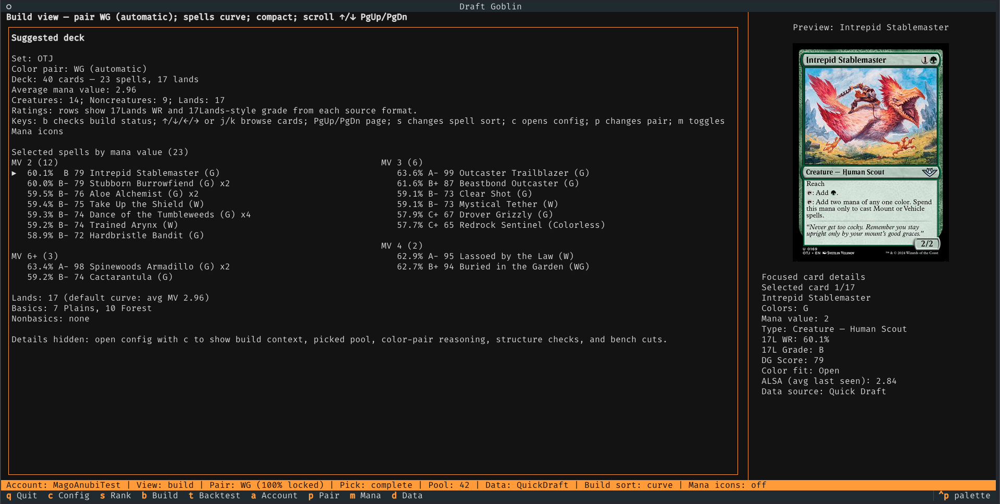

<p align="center">
  
</p>

# Draftgoblin

Draftgoblin is an unofficial terminal draft assistant for MTG Arena Quick Drafts. It reads Arena's local `Player.log`, recognizes each pack and pick, and ranks the available cards while you draft. When the draft is complete, it also suggests a 40-card deck from your pool.

Draftgoblin is read-only: it does not write to, inject into, or automate MTG Arena. Card details come from [Scryfall](https://scryfall.com/) and draft statistics come from [17Lands](https://www.17lands.com/).

## Screenshots

### Live pick recommendations

Cards are ranked in real time, with the raw 17Lands win rate and grade shown alongside Draftgoblin's pool-aware score.



### Suggested deck

At the end of the draft, Draftgoblin selects a color pair, spells, and mana base for a 40-card build.



## How recommendations work

Draftgoblin keeps the data behind every recommendation visible instead of presenting a black-box pick order:

- **17Lands ratings:** each card shows its Games-in-Hand win rate (`17L WR`) and a 17Lands-style grade. Quick Draft data is preferred; Premier Draft data is used as a fallback when Quick Draft samples are missing or too small.
- **DG Score:** the default 0-100 ranking normalizes 17Lands win rates across the set. A card without a reliable sample starts from a neutral score of 50, adjusted by its Average Last Seen At (`ALSA`) when available.
- **Color fit:** early picks stay open. From pick 6 onward, scores gradually favor the colors supported by the drafted pool; from pick 16, on-color cards receive the full bonus and off-color cards the full penalty. Strong picks influence the inferred color pair more than filler.
- **Close early picks:** when two cards have similar scores, set- and format-specific 17Lands color-pair win rates can break the tie without forcing an early commitment.
- **Transparent alternatives:** press `s` to compare rankings by DG Score, raw 17Lands win rate, ALSA, or mana value. The interface also identifies neutral-prior and Premier-fallback rows.
- **Deck suggestion:** the builder evaluates two-color pairs using card quality and 17Lands pair performance, then chooses spells and lands while considering creatures, curve, colored mana requirements, and cached 17Lands deck-structure targets when available.

DG Score is the default because it performed better than raw 17Lands win rate in Draftgoblin's offline pick benchmarks. It is still guidance rather than a perfect pick order: public statistics reflect the decks, players, and contexts in which cards were played.

For the complete methodology, see [pick scoring](docs/pick-scoring.md), [benchmarking](docs/benchmarking.md), and the [deck builder](docs/deck-builder.md).

## How to use it

Draftgoblin requires [uv](https://docs.astral.sh/uv/), which provides the required Python runtime and installs the command in an isolated environment.

### 1. Install

Install uv with Homebrew on macOS:

```bash
brew install uv
```

Or with WinGet on Windows:

```powershell
winget install --id=astral-sh.uv -e
```

Then install Draftgoblin:

```bash
uv tool install draftgoblin
```

### 2. Enable Arena logs

In MTG Arena, open **Settings → Account**, enable **Detailed Logs (Plugin Support)**, and restart Arena.

### 3. Prepare card data

Run this once after installation, and again when you want fresh card metadata:

```bash
draftgoblin refresh-data
```

### 4. Start drafting

Start Draftgoblin before entering a Quick Draft:

```bash
draftgoblin watch
```

The app detects the set and follows the draft automatically. If 17Lands ratings are not cached for that set, it offers to download them. Use the arrow keys or `j`/`k` to browse cards, `s` to change the ranking, `b` to open the current build, `c` to configure the view, and `q` to quit.

Draftgoblin uses the standard Arena log location on macOS and Windows. If your log is elsewhere, pass it explicitly:

```bash
draftgoblin watch --log-path /path/to/Player.log
```

Upgrade later with:

```bash
uv tool upgrade draftgoblin
```

Live recommendations currently support Quick Draft. Windows support is best-effort; Linux can be used only by pointing `--log-path` to an Arena log inside Wine or Proton.

## Branding and compliance

Draftgoblin is not affiliated with, sponsored by, approved by, or endorsed by Wizards of the Coast, Scryfall, or 17Lands.

Draftgoblin is unofficial Fan Content permitted under the Fan Content Policy. Not approved/endorsed by Wizards. Portions of the materials used are property of Wizards of the Coast. ©Wizards of the Coast LLC. Card data from Scryfall and 17Lands; neither service endorses this tool.
